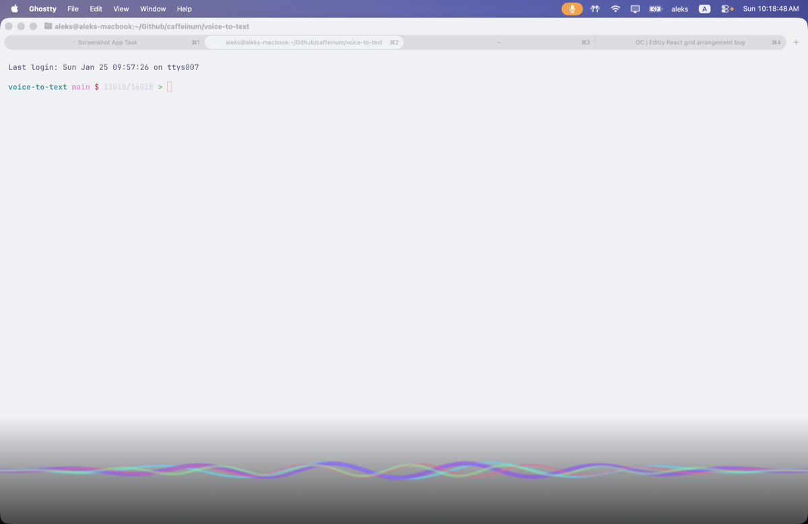

# yapless

voice-to-text that stays out of your way.

no menu bar icon. no dock clutter. no background daemon to babysit. just hit a hotkey, talk, and text appears in your active app.



## why yapless

most voice tools want to live in your system tray 24/7. they want windows, preferences panes, and "is it running?" anxiety.

yapless is different:
- **zero ui** - no icons, no windows, nothing to manage
- **instant-on** - works the first time, every time (just needs mic access once)
- **visual feedback** - animated overlay so you know it's listening
- **then it's gone** - transcribes, pastes, exits

open source alternative to superwhisper, wispr flow, and macwhisper.

## install

```bash
# clone and build
git clone https://github.com/caffeinum/yapless.git
cd yapless
swift build -c release
cp .build/release/yapless ~/.local/bin/

# add raycast script command
# Extensions → Script Commands → Add the raycast/ folder
# assign a hotkey (e.g., ⌥ + Space)
```

## backends

yapless auto-detects what you have:

| backend | setup | speed |
|---------|-------|-------|
| **whisper.cpp** (local) | `brew install whisper-cpp` | fastest — Metal, ~0.5s per clip |
| **groq** (cloud) | set `GROQ_API_KEY` | fast, large-v3 accuracy |
| **whisperkit** (local) | apple native | slower to start |

local whisper.cpp is the default when installed — on apple silicon it beats the cloud's network round-trip outright. groq stays as the fallback (and the accuracy pick: it runs large-v3).

## usage

```bash
# start recording, paste to active app
yapless --record --paste

# clipboard only
yapless --record --clipboard --no-paste

# different animation
yapless --record --animation-style waveform
```

## config

`~/.config/yapless/config.json`:

```json
{
  "animation": {
    "style": "equalizer",
    "position": "bottomCenter",
    "shellColor": "#141819",
    "primaryColor": "#35E08A",
    "secondaryColor": "#0E7C5A"
  },
  "whisper": {
    "backend": "auto",
    "model": "base",
    "language": null,
    "vocabulary": ["Raycast", "yapless", "Anthropic"]
  },
  "output": {
    "pasteToActiveApp": true,
    "copyToClipboard": true
  },
  "audio": {
    "inputPriority": ["usb microphone", "MacBook Pro Microphone"]
  },
  "storage": {
    "saveHistory": true
  }
}
```

### teaching it words

names and jargon that whisper keeps mangling go in `whisper.vocabulary`. they're sent as whisper's initial prompt, which biases spelling — it's a nudge, not a hard rule, and a long list dilutes it, so keep it to words you actually say. `whisper.prompt` sets a freeform sentence in front of them.

honored by groq, deepinfra, fireworks, and local whisper-cpp. replicate, fal and whisperkit take no prompt and ignore it.

### running from a launcher

Raycast kills a script command after ~60s, which cuts the recording off mid-transcription. `--detach` hands the run to its own session and returns immediately, so the launcher finishes while yapless keeps going:

```bash
yapless --record --paste --detach
```

output goes to `~/.local/share/yapless/detached.log`. the bundled `raycast/*.sh` already use it.

### sounds

one sound per event, so you can tell what happened without looking:

```json
"output": {
  "startSound": "Purr",
  "processingSound": null,
  "completionSound": "Pop",
  "refusedSound": "Bottle",
  "errorSound": "Bottle"
}
```

| event | meaning |
|-------|---------|
| `startSound` | recording began, mic is live |
| `processingSound` | you stopped talking, transcription is running |
| `completionSound` | text is ready and pasting |
| `refusedSound` | refused — not enough voice in the recording |
| `errorSound` | transcription failed outright |

each takes a macOS system sound name (`Purr`, `Tink`, `Pop`, `Bottle`, `Morse`, `Funk`, `Submarine`, …) or an absolute path to your own file. `null` or `""` silences that one event.

pick short ones for `processingSound` — anything over ~0.8s is still playing when the text arrives. and note the start sound plays while the mic is already recording: at a normal volume on a directional mic it doesn't reach the recording, but a loud one on a laptop mic could feed itself.

### refusing silence

whisper invents confident sentences out of silence — "Thank you for watching!" is a real thing it returns for an empty room. yapless refuses to transcribe a recording that has too little voice-level audio in it:

```json
"audio": {
  "minVoicedSeconds": 0.4,
  "silenceFloor": 0.01
}
```

set `minVoicedSeconds` to 0 to turn it off. a refusal plays a sound and shows an error on the overlay — it's never a silent no-op — and the audio is kept, so `yapless --transcribe latest` still rescues it. `--transcribe` deliberately skips the check: naming a recording is you saying you meant it.

these numbers were measured over 527 real recordings; loudness alone doesn't work (a quiet 59-second dictation peaks lower than a one-word hallucination), but *how long* the audio carries voice does.

### sending the transcript somewhere else

`output.command` hands the finished transcript to any command on **stdin**, alongside the usual clipboard/paste:

```json
"output": {
  "command": "/absolute/path/to/your-script",
  "commandTimeout": 5.0
}
```

or per-run: `yapless --record --output-command /absolute/path/to/your-script`

while recording, the overlay shows where the transcript is going (`→ paw dm voice`), so a dictation bound for somewhere other than your keyboard says so at the time rather than after.

the transcript arrives on stdin (never as an argument — dictation contains quotes, and arguments show up in `ps`), with `YAPLESS_TRANSCRIPT_LENGTH` set. yapless waits up to `commandTimeout` seconds for the command, then kills it, so a slow sink can't hang your dictation and a forked one can't be killed mid-flight. use an absolute path: under `--detach` there's no login shell PATH.

### picking a microphone

`audio.inputPriority` is an ordered **allow-list** — the first entry that's actually connected wins, and nothing off the list is ever opened. this is how you keep yapless off your AirPods: leave them off the list and they're never touched, even when macOS makes them the system default (which it does, silently, on every reconnect). if none of the listed devices are connected yapless stops and prints what *is* available, rather than quietly recording from something else.

other forms:

- `"inputDevice": "usb microphone"` — a single device (name or UID, substring ok)
- `"inputDevice": "default"` — whatever macOS currently calls the default input
- `"excludeInputs": ["AirPods"]` — devices that must never be opened. if the system default turns out to be one of them, yapless stops and tells you, instead of picking a replacement you didn't ask for
- `--input <name>` on the command line beats all of it, bluetooth included

with nothing configured, yapless uses the system default exactly as macOS reports it — it does not second-guess your device choices.

opening a bluetooth mic forces the headset into call mode: playback quality drops and the headset is yanked away from whatever else was using it. `yapless --list-inputs` marks those devices with ⚠︎.

### history

by default, yapless saves all recordings and transcriptions to `~/.local/share/yapless/`:

```
~/.local/share/yapless/
├── recordings/      # .wav files
└── transcriptions/  # .txt files
```

to disable, set `storage.saveHistory` to `false` in config.

### animations

| style | description |
|-------|-------------|
| `orb` | breathing orb that pulses with audio |
| `waveform` | real-time audio visualization |
| `glow` | screen edge glow (dynamic island vibes) |
| `siri` | multi-colored wave lines |
| `dot` | cursor becomes a dot that pulses with voice (default) |
| `pill` | floating capsule, bars scroll with your loudness over the last ~1.7s |
| `equalizer` | same capsule, fixed frequency bands rising and falling in place |

## how it works

1. raycast triggers `yapless --record`
2. overlay appears, recording starts
3. you talk
4. click overlay or hit hotkey again to stop
5. audio goes to whisper (cloud or local)
6. text pastes into your active app
7. yapless exits

no daemon. no persistence. summoned when needed, gone when done.

## license

MIT
